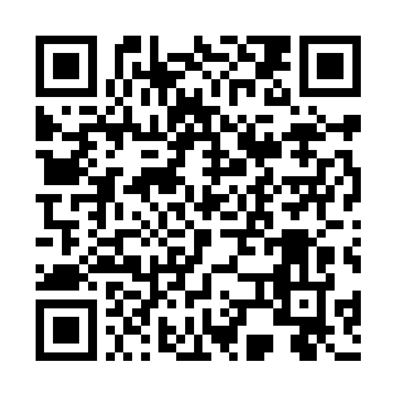

# BitcoinTicker

BitcoinTicker is a desktop gadget that displays Bitcoin related information (Price, Blockheight, Hash rate, Sats per USD, Moscow time and mempool size). The ticker is built for the [LilyGo T5-4.7 inch E-Paper display](http://www.lilygo.cn/prod_view.aspx?TypeId=50061&Id=1384&FId=t3:50061:3). Data is retrieved via Wi-Fi from [CoinGecko](https://coingecko.com) and [Mempool.space](https://mempool.space).

## Installation

You can clone this repository and build a firmware image yourself. The repository is compatible with platformio/Visua Studio Code. A web [installer](https://pieterjm.github.io/BitcoinTicker/installer/).  to flash the latest firmware version from your browser (Chrome or Edge) is also availeble.

Running the ticker and configuring Wi-Fi is quite self explanatory. The Ticker tells you what to do.

## Comments, feedback, Donation

Comments or feedback? send an e-mail to pieter(at)meulenhoff.org. If you enjoy the ticker, send me donation via lightning.

